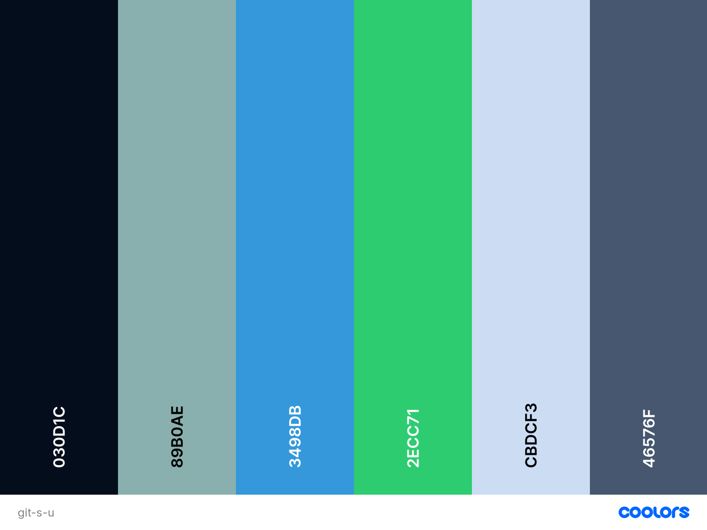

# Github Search User

you can search username and get information of user and see the important information in the charts

## Demo

See demo on github pages
[github search user](https://kamalheydari.github.io/react-github-users/)


## Clone

```
https://github.com/kamalheydari/react-github-users.git
```

## Using

- react
- fusioncharts
- node-sass
- react-icons

## Color palette


